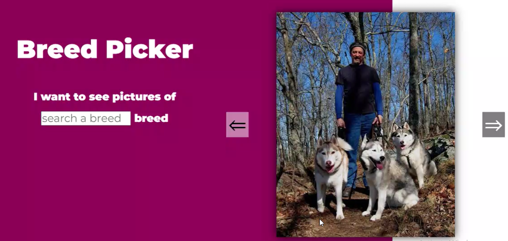

# Welcome to "Dog Breed Selector" web app!

We all love dogs!!

## Video Demo:

If you want to checkout my web app then please visit : https://youtu.be/XWiQ0ZO_J38

## Description:

I am a dog lover. One day i thought of searching brreds of dog. So i went to google, typed in the search box and pressed enter. So many links popedup. It was little complex to search for breed names. Every link was showing something different. So i thought why not build something on my own that will aggregate all the dog breeds and their photos at one place after all CS50 course has taught me enough skills that i can build such thing on my own!

So from here i got the idea of buiding this app. And i decided that i will make this as my final CS50 project.
This is my attempt for the **final CS50 project**. Through my webapp, user can see all the photos of dog breed at one place. I am sure my app will be loved by all especially if you are a dog lover. I implemented two UX feature which i am sure you will like. One is Slider at the bottom and other is text filteration.

## Feature-1:

I have added a slider at the bottom of my site as shown in the below image.

It increases the User Experience considerably (UX). This can also be used to see previous/ next images instead of totally relying on previous.next buttons on the left & right of photo. It tells user how many images are there in a particular breed. It also helps the user keep track of his favorite image of a dog breed. If in future he wants to see the same image then he knows where to search by moving the slider to that particular image number.

## Feature-2:

Also i have implemented dynamic search filter which shows only those breed names having those input text letters as seen below.

In above pic, user types 'bu' in the input text search and my app automatically diplays only those breeds having 'bu' in them. User doesn't have to press any button to search. It dynamically searches among all the breed names. This feature also helps increase user experience (UX) considerably.

This is built using HTML,CSS and Javascript. The breed images are taken from Dogceo API. Javascript fetch method is used to send the request to the server and then that request is parsed as json object.

Do comment in the youtube video (link above) if you also liked as well.

## About CS50

CS50 is a openware course from Havard University and taught by David J. Malan

Introduction to the intellectual enterprises of computer science and the art of programming. This course teaches students how to think algorithmically and solve problems efficiently. Topics include abstraction, algorithms, data structures, encapsulation, resource management, security, and software engineering. Languages include C, Python, SQL, HTML, CSS, and JavaScript.

The course can be found at https://cs50.harvard.edu/x/2020/